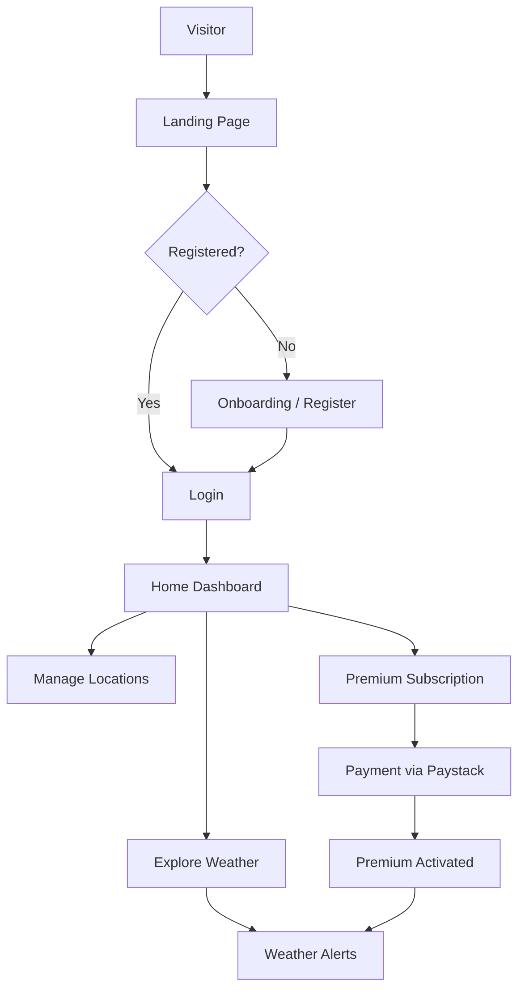
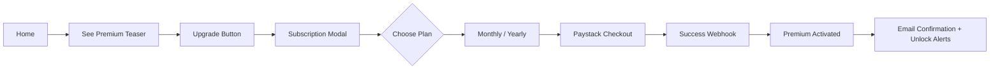

**Daily-Planet App – Detailed User Flow Mapping**

### 1. Overall User Journey Overview



---

### 2. Detailed User Flows

#### **Flow 1: First-Time User Onboarding**

1. **Landing Page** → Hero with Globe + "Get Started" CTA
2. Click **Sign Up**
3. **Registration Form**
   - Email, Password, Name, Preferred Units (Metric/Imperial)
   - Optional: Quick Google login
4. Email verification (optional for MVP)
5. **Welcome Screen** → Brief tutorial (swipeable cards)
6. Set default location (GPS prompt or search)
7. → **Home Dashboard**

#### **Flow 2: Login**

1. Landing → **Login** button
2. Enter credentials → JWT stored
3. Success → Redirect to Home
4. Error states: Wrong password, account not found, "Forgot Password"

#### **Flow 3: Main Dashboard / Home (Core Flow)**

```
Landing → Auth → Home
          ↓
   [Non-scrollable Globe-Centric Page]
          ↓
├── Top Nav (Logo + Location Toggle + Profile)
├── Central Interactive Globe (drag to rotate)
├── Floating Current Weather Card (Left)
├── Toggleable Detail Card (Top Right)
├── Bottom Quick Actions:
    ├── Search New Location
    ├── Saved Locations
    ├── Premium Alerts
    └── Settings
```

**Key Interactions on Home:**
- Tap globe markers → Show location weather
- Toggle card → View detailed forecast + stats
- Pull-to-refresh (future)

#### **Flow 4: Weather Exploration**

1. Home → Search bar
2. Enter city → API call (Open-Meteo)
3. View:
   - Current conditions (large temp + icon)
   - Hourly forecast
   - 7-day forecast
   - Details (humidity, wind, UV)
4. Save to favorites → Added to user locations

#### **Flow 5: User Profile & Location Management (CRUD)**

1. Profile Icon → Profile Page
2. **View/Edit Profile**
   - Update name, email, preferences
3. **Saved Locations**
   - List of locations (cards)
   - Add new → Search + Save
   - Set default
   - Delete
4. Logout option

#### **Flow 6: Premium Subscription Flow**



**Premium Features Unlocked:**
- Email weather alerts
- Unlimited saved locations
- Advanced forecasts
- Ad-free experience

#### **Flow 7: Weather Alert Configuration (Premium)**

1. Profile → Alerts
2. Select location
3. Set conditions:
   - Rain > X mm
   - Temperature above/below threshold
   - Severe weather
4. Choose frequency (Daily digest / Instant)
5. Save → Backend cron job activated

---

### 3. Error & Edge Case Flows

- **No Internet**: Show cached weather + "Offline Mode" banner
- **API Failure**: Graceful fallback message + retry button
- **Payment Failure**: Clear error + retry option
- **Session Expired**: Auto redirect to login

---

### 4. Navigation Map (Information Architecture)

- **Public**: Landing, Login, Register
- **Private**:
  - `/` → Home (Globe Dashboard)
  - `/weather/:location` → Detailed view
  - `/profile`
  - `/locations`
  - `/alerts` (Premium only)
  - `/subscription`

---

### 5. Micro-interactions & Feedback

- All buttons: Pressed (inset shadow) animation
- Successful actions: Subtle success toast with checkmark
- Loading states: Skeleton loaders with neumorphic style
- Globe: Smooth drag + auto-rotation pause on interaction

---